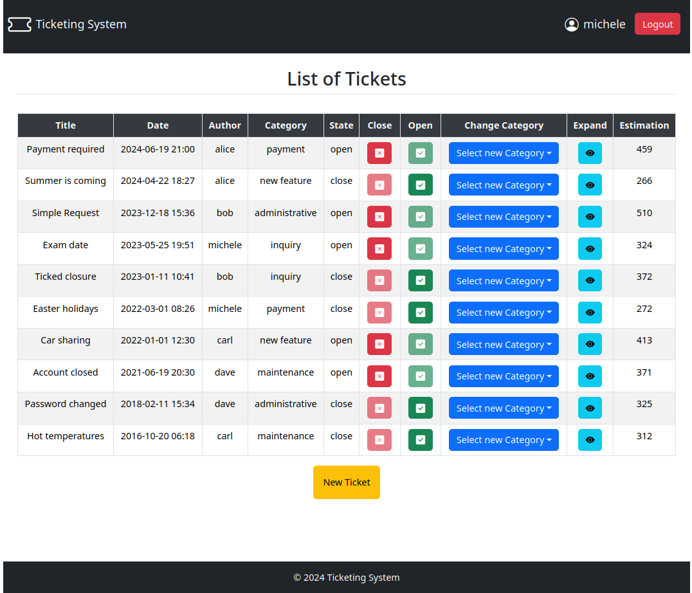
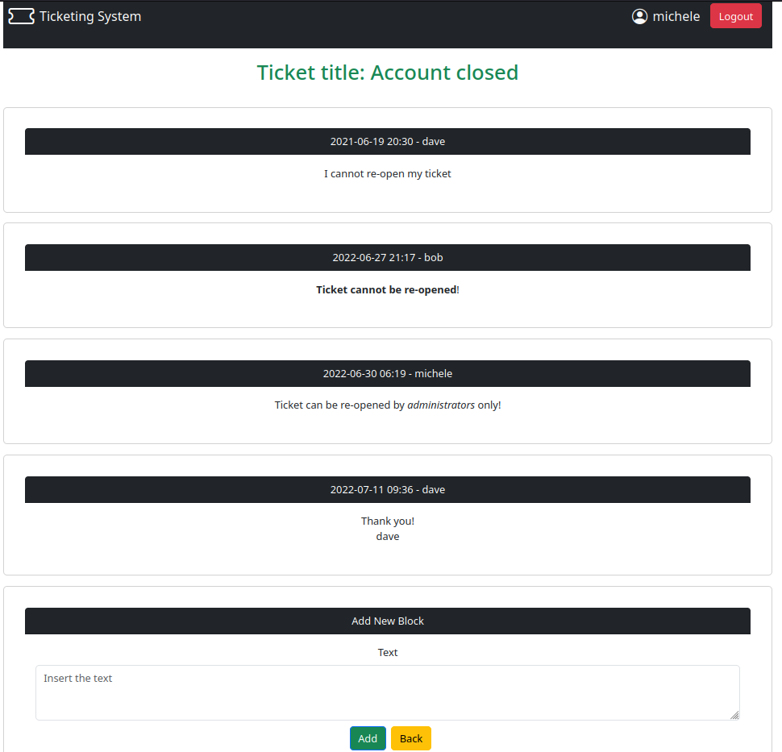
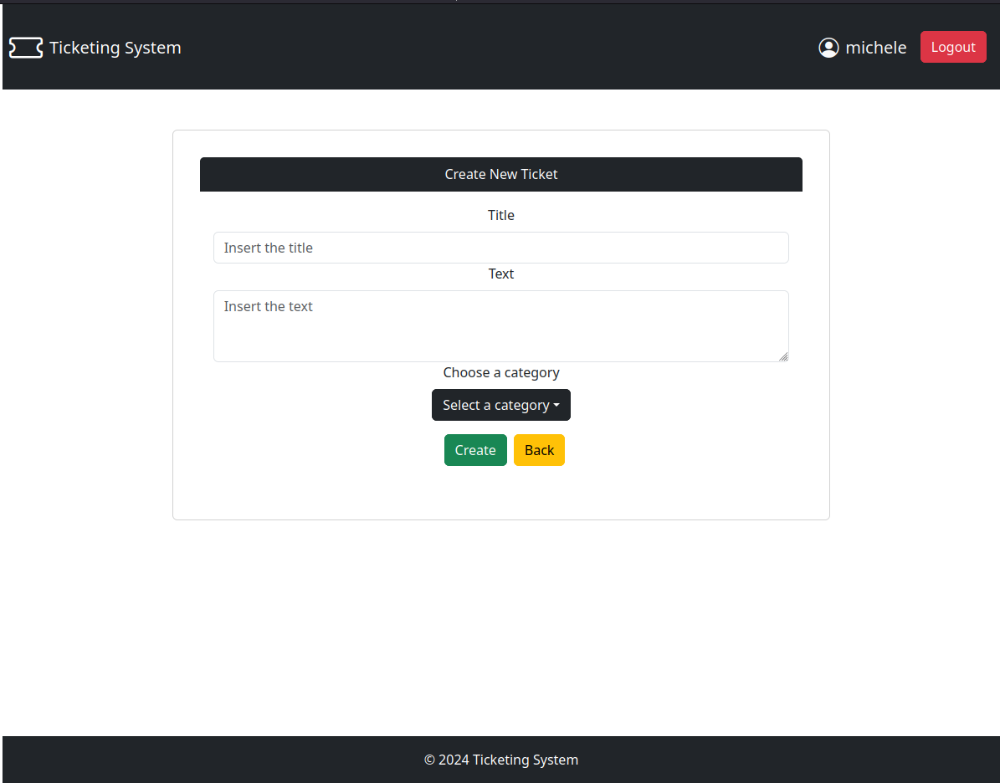

# Exam #1: "Ticketing system"
## Student: MERICO MICHELE

## React Client Application Routes

- Route `/`: Home page shows the list of tickets for anybody. Logged in users can also close a ticket for which they are the owner, see the text blocks related to each specific ticket, and create new tickets. In addition, logged in administrators can update the state and change the category of each ticket.
- Route `/create`: Form for creating a ticket. Before submitting the ticket, a confirmation page is shown containing the data entered and the estimated time to close the ticket (in hours for administrators and days for users). The user can decide to re-edit the ticket or submit it.
- Route `/ticket/:ticketId`: Shows the list of blocks associated to the ticket specified by the ticketId parameter. It also contains a form for submitting a new block related to the specific ticket. The ticketId must be an integer related to an existing ticket.
- Route `/login`: Login form, allows users to login. After a successful login, the user is redirected to the main route ("/").
- Route `/*`: Page for nonexisting URLs (_Not Found_ page) that redirects to the home page.

## API Server

#### Get all tickets

* `GET /api/tickets`
* Description: Get the full list of tickets
* Authentication not needed
* Request body: _None_
* Response: `200 OK` (success)
* Response body: Array of tickets, each describing one ticket

    ``` JSON
    [ 
        { 
            "id": 1,
            "title": "Simple request",
            "text": "Where is the office?",
            "state": "open",
            "category": "maintenance",
            "date": {...,'$d': 2023-12-18T15:36:00.000Z,...},
            "ownerId": 2, 
            "username": "bob" 
        },
         ... 
    ]
    ```
* Error response: `500 Internal Server Error` (generic error)

#### Get ticket by id

* `GET /api/ticket/:id`
* Description: Get the ticket corresponding to the id
* Authentication needed
* Request body: _None_
* Response: `200 OK` (success)
* Response body: One object containing the required ticket

    ``` JSON
    { 
        "id": 2,
        "title": "Payment required",
        "text": "Where are my money?",
        "state": "open",
        "category": "payment",
        "date": {...,'$d': 2024-06-19T21:00:00.000Z,...},
        "ownerId": 1, 
        "username": "alice" 
    }
    ```
* Error responses: `500 Internal Server Error` (generic error), `404 Not Found` (ticket not found)

#### Get blocks by ticket id

* `GET /api/blocks/:id`
* Description: Get all blocks related to the ticket specified by the id
* Authentication needed
* Request body: _None_
* Response: `200 OK` (success)
* Response body: Array of blocks, each describing one block

    ``` JSON
    [ 
        { 
            "id": 2,
            "title": "Payment required",
            "text": "Where are my money?",
            "state": "open",
            "category": "payment",
            "date": {...,'$d': 2024-06-19T21:00:00.000Z,...},
            "ownerId": 1, 
            "username": "alice"
        },
        ...
    ]
    ```
* Error responses: `500 Internal Server Error` (generic error), `400 Bad Request`

  #### Create new ticket

* `POST /api/tickets`
* Description: Create a new ticket
* Authentication needed
* Request body: Description of the object to add (id is not required)
    ``` JSON
    { 
        "title": "New ticket",
        "text": "This is a new ticket.",
        "state": "open",
        "category": "administrative",
        "date": {...,'$d': 2023-11-19T17:28:00.000Z,...},
        "ownerId": 4
    }
    ```

* Response: `201 Created` (success)
* Response body: The unique id assigned by the database to the new ticket.
* Error responses: `503 Service Unavailable` (database error), `404 Not Found` (user specified by ownerId not found), `422 Unprocessable Content` (request body incorrect)

  #### Create new block

* `POST /api/ticket/:id/addBlock`
* Description: Create a new block related to the ticket specified by the id
* Authentication needed
* Request body: Description of the object to add (id is not required)
    ``` JSON 
    { 
        "text": "This is a new block.",
        "date": {...,'$d': 2022-07-23T12:15:00.000Z,...},
        "author": "carl"
    }
    ```
* Response: `201 Created` (success)
* Response body: The unique id assigned by the database to the new block.
* Error responses: `503 Service Unavailable` (database error), `404 Not Found` (author or ticket not found), `422 Unprocessable Content` (request body incorrect)

  #### Update a ticket

* `PUT /api/ticket/:id`
* Description: Update the state or the category of the ticket specified by the id
* Authentication needed
* Request body: Object containing the id and the state, or the category
    ``` JSON 
    { 
        "id": 1,
        "state": "close"
    }
    ```

    or

    ``` JSON
    { 
        "id": 1,
        "category": "payment"
    }
    ```

* Response: `201 Created` (success)
* Response body: _None_
* Error responses: `503 Service Unavailable` (database error), `422 Unprocessable Content` (request body incorrect)

### User management

#### Login

* HTTP method: `POST`  URL: `/api/sessions`
* Description: authenticate the user who is trying to login
* Request body: credentials of the user who is trying to login

``` JSON
{
    "username": "username",
    "password": "password"
}
```

* Response: `200 OK` (success)
* Response body: authenticated user

``` JSON
{
    "id": 1,
    "username": "alice", 
    "admin": 1
}
```

* Error responses:  `500 Internal Server Error` (generic error), `401 Unauthorized User` (login failed)

#### Check if user is logged in

* HTTP method: `GET`  URL: `/api/sessions/current`
* Description: check if current user is logged in and get her data
* Request body: _None_
* Response: `200 OK` (success)

* Response body: authenticated user

``` JSON
{
    "id": 2,
    "username": "bob", 
    "admin": 0
}
```

* Error responses: `500 Internal Server Error` (generic error), `401 Unauthorized User` (user is not logged in)

#### Logout

* HTTP method: `DELETE`  URL: `/api/sessions/current`
* Description: logout current user
* Request body: _None_
* Response: `200 OK` (success)

* Response body: _None_

* Error responses: `401 Unauthorized User` (user is not logged in)

### User authorization

#### Get token

* `GET /api/auth-token`
* Description: 
* Authentication needed
* Request body: _None_
* Response: `200 OK` (success)
* Response body: Object containing the token and the level of the user

    ``` JSON
    { 
        "token": "token",
        "authLevel": "admin"
    }
    ```
* Error responses: `401 Unauthorized`

## API Server2

  ### Returns the estimated closing time for a ticket

* `POST /api/estimation`
* Description: Get the estimated closing time for a specific ticket expressed in hours for administrators and days for users.
* Authorization needed
* Request headers: JWT token with the authorization access level
* Request body: The title and category of the ticket for which a closing time estimation is required
    ``` JSON
    {
        "title": "Simple request",
        "category": "maintenance"
    }
    ```
* Response: `200 OK`
* Response body: Object containing the estimation
    ``` JSON
    { 
        "estimation": 100
    }
    ```
* Error responses: `400 Unauthorized`, `401 Bad Request` (invalid request body)

  ### Returns the estimated closing time for all the tickets

* `POST /api/estimations`
* Description: Get the estimated closing time for all the tickets
* Authorization needed
* Request headers: JWT token with the authorization access level
* Request body: Object containing all the tickets
    ``` JSON
    [ 
        { 
            "id": 1,
            "title": "Simple request",
            "category": "maintenance"
        },
        ...
    ]
    ```
* Response: `200 OK`
* Response body: Object containing the estimation for each ticket
    ``` JSON
    [ 
        { 
            "id": 1,
            "estimation": 100
        },
        ...
    ]
    ```
* Error responses: `400 Unauthorized`, `401 Bad Request` (invalid request body)


## Database Tables

* Table `users` - (id), username, salt, password, admin
* Table `tickets` - (id), title, text, category, state, date, <ins>ownerId</ins><br>
There is a foreign key, ownerId, that references the id in the users table.
* Table `blocks` - (id), date, author, text, <ins>ticketId</ins><br>
There is a foreign key, ticketId, that references the id in the tickets table.


## Main React Components

* `App` (in `App.jsx`): The app renders a main layout with a header, footer, and dynamic content in between based on routes. It uses various state hooks to manage user authentication, ticket data, and estimations, updating the UI accordingly with routes for listing tickets, creating tickets, viewing ticket details, creating blocks and user login.
* `Tickets Route` (in `App.jsx`): it is the main component of the home page for generic users and shows the list of the tickets. It shows additional functionality based on the role of logged in users.
* `Tickets Table` (in `TableComponents.jsx`): it is the table that contains the information about the tickets. It shows for each user, authenticated or not, the title, the date, the state, the category and the owner of the ticket.
* `Ticket Row` (in `TableComponents.jsx`): it renders the information safely for each ticket and allows users, based on their authentication, to edit it. It allows logged in users to expand a single ticket for viewing associated blocks. Logged in user can also close a ticket for which they are owner. Logged in administrator can, in addition, change the category and the state of a ticket, and see an estimation closing time for each ticket.
* `BlocksRoute` (in `BlocksRoute.jsx`): it fetches blocks related to a specific ticket from the database in order to pass them to the Blocks component and allows a user to create a block only if it is logged in and the state of the ticket is "open". It manages the states and retrieve the id of the ticket for which blocks are requested from the URL.
* `Blocks` (in `BlocksRoute.jsx`): it shows a message if a ticket has not got associated blocks, or it simply passes each ticket to the Block Row component.
* `Block Row` (in `BlocksRoute.jsx`): it shows the date, the author and the text of each block related to a specific ticket. No operations are allowed on the blocks. It is responsible for safely showing the information.
* `Block Form` (in `BlocksRoute.jsx`): the form that only logged in users or administrators can use for creating and submitting a new block associated to a specific ticket. It is responsible for sanitizing input data before send them to the database and for adding date and author information to the new block.
* `Creation Form` (in `CreateRoute.jsx`): the form that only logged in users or administrators can use for submitting a new ticket. When all the information needed are inserted, users are asked to confirm them and submit the ticket, or to re-edit it. It is responsible for sanitizing input data submitted by the user before sending them to the server and for adding ownerId, date and state to the new ticket.
* `Login Form` (in `AuthComponents.jsx`): the login form that users can use to login into the app. This is responsible for the client-side validation of the login credentials.


## Screenshots

### Tickets list seen by the administrator



### Ticket expanded



### Form for creating new ticket



## Users Credentials

### Administrators

* username: michele, password: micheleWA 
* username: alice, password: aliceWA

### Users

* username: bob, password: bobWA1
* username: carl, password: carlWA
* username: dave, password: daveWA
